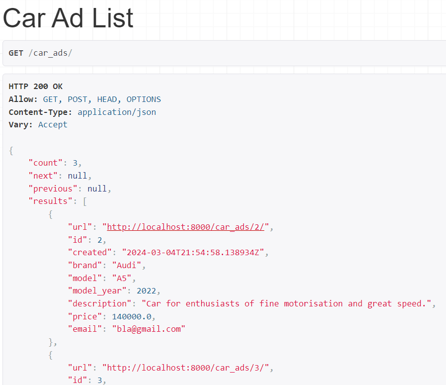
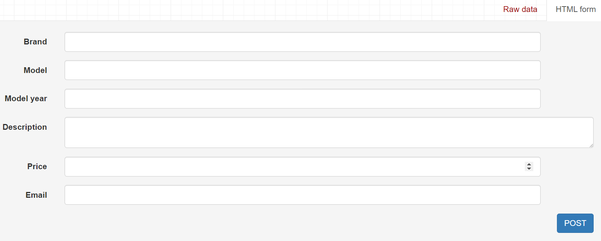
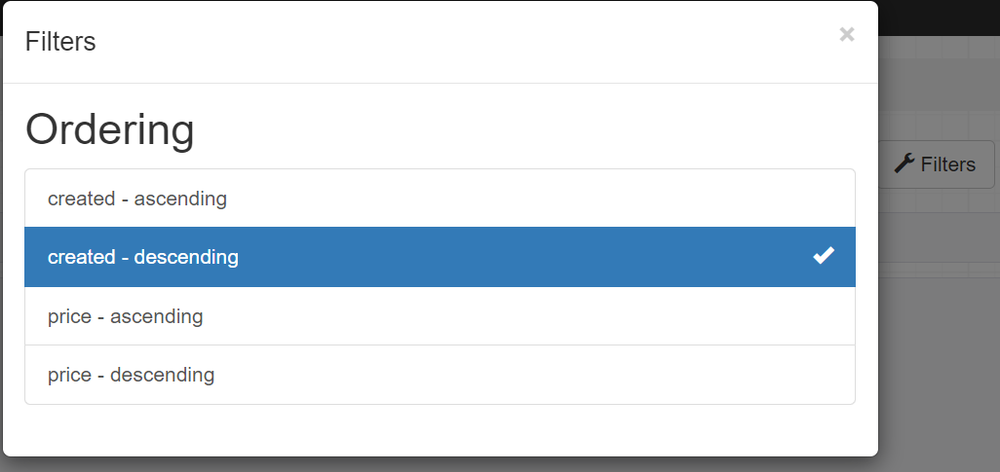

# Car Advertisement API

## Setup

Install docker from [docker install](https://docs.docker.com/engine/install/)

Run
    $ docker-compose up -d --build

Run tests
    $ python manage.py test

Run test coverage
    $ coverage run manage.py test
    $ coverage report

## Functionalities

Open API on port 8000 [API](http://localhost:8000/)

Listing all ads and posting new ad [Car ads](http://localhost:8000/car_ads/)

Sorting both ascending and descending on price and ad created time available in filters:

Listing, updating, deleting one ad [Example record](http://localhost:8000/car_ads/4/)
